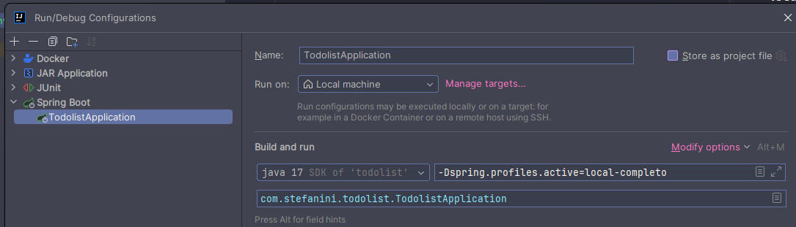

# Projeto Todo List para processo seletivo Stefanini Group.
Desenvolvido por: Guilherme de Souza Pinto da Silva

#### Requerimentos:
- Java 17
- Docker
- Docker-compose

### Resumo
Nesse projeto foi desenvolvida uma simples aplicação de todo-list utilizando JAVA 17 com Spring-Boot e SQL-SERVER Express para cadastrar, alterar, listar, buscar e deletar todos.

ATENÇÃO: O Código principal está todo na BRANCH develop, a main só tem o código de inicialização do projeto, justamente por também não ter sido criado um ambiente de produção.


## Estrutura da aplicação

A aplicação está estruturada nas seguintes principais camadas:

- Controllers -> Responsável pela entrada e saída de requests e responses http. 
- Service -> Camada para implantação da regra de negócio.
- Repository -> Camada para comunicação com o banco de dados e queries.
- Model -> Camada contento as entidades que representam as estruturas do Banco de dados.

**Adicionalmente também foram adicionados scripts do flyway para versionamento de banco de dados.**

O banco de dados está estruturado de tal forma que só existe uma tabela nele chamada "todo" que armazena os todos.
Ela tem os seguintes campos:
- id
- titulo
- descricao
- status
- atualizadoEm
- criadoEm

Poderia ter sido criada outra tabela para os Status de cada 'todo' (recomendável e aplicações maiores) mas o fluxo foi simplificado apenas
com um Enum a nível de código e uma coluna Varchar no banco.

### Endpoints:

Porta: 8082

**Clique no link e importe essa colection no seu client HTTP favorito (postman, etc...) para usar a API tanto na cloud quanto localmente:**

[collection-http.json](collection%2Fcollection-http.json)

#### **-- GET**

```/todos/?page=*&size=*&sort=*,*``` --> Buscar todos os 'todos' de maneira paginada

```/todos/:id``` --> Buscar um 'todo' pelo id.

#### **-- POST**

```/todos/create``` --> Criar um novo 'todo'.

body: 
```json 
{
"titulo": "Tarefa de português",
"descricao": "Uma tarefa difícil cheia de palavras complicadas.",
"status": 0 // "Pode passar os status [0,1,2] e as respectivas strings "PENDENTE, EM_ANDAMENTO, CONCLUIDO" 
}
```

#### **-- PUT**

```/todos/:id``` --> Alterar um 'todo' pelo id.

body:

```json
{	
	"titulo": "Tarefa de português",
	"descricao": "Uma tarefa difícil cheia de palavras difíceis e regras de ortografia",
	"status": 1 // "Pode passar os status [0,1,2] e as respectivas strings "PENDENTE, EM_ANDAMENTO, CONCLUIDO" 
}
```

#### **-- DELETE**

```/todos/:id``` --> Deletar um 'todo' pelo id


------------------------------------------------------------------------------------------------------------------------

A aplicação apresenta 3 (três) escopos (ambientes):  **local-desenvolvimento**, **local-completo**, **dev**.

Obs: Após tentar rodar um escopo local e tentar rodar outro local não esqueça de apagar a pilha de containers criada pelo escopo anterior.
# Ambientes de desenvolvimento:

- ## local-desenvolvimento :
Este ambiente foi criado para que os desenvolvedores da aplicação criem um banco de dados SQL-SERVER EXPRESS em suas máquinas e possam rodar a aplicação nesse perfil a partir de qualquer IDE como o Intellij e seguir com seu desenvolvimento. \
Para que isso seja feito basta adicionar a seguinte variável de ambiente nas VM Options na hora de rodar o projeto na sua IDE: <br> <br>
**-Dspring.profiles.active=local-completo** \
Asssim a aplicação referenciará as devidas configurações no devido arquivo **.yml** . <br> <br>

A seguir é possível visualizar uma imagem sobre essa arquitetura:


Imagem mostrando a configuração para rodar o projeto na IDE:



- **Como criar e usar esse ambiente?**

1. Clone o repositório do github
2. Abra a aplicação na sua IDE Favorita
3. Configure a aplicação para rodar com Java 17
4. Instale as dependências do Maven
5. Navegue para a pasta resources do projeto dentro da pasta docker e rode o docker-compose responsável por criar o SQL-Server express:
      
    ```cd ./src/main/resources/docker/```
      <br> Rode: <br>
    ```docker compose -p containers-stefanini -f docker-compose.local-desenvolvimento.yaml up```
6. Rode seu projeto spring no Intellij com as configurações providas na imagem anterior.
7. Pronto! pode testar sua api rodando localmente.

- ## local-completo:
Este ambiente foi criado para você examinador ou qualquer um que queira rodar a aplicação de maneira
completa localmente em uma network do docker com três containers! <br> 
Este ambiente basicamente cria o banco de dados SQL-Server Express, a aplicação spring buildada e um servidor proxy reverso do nginx para direcionamento na aplicação spring, todos ambientes localmente.

A seguir é possível visualizar uma imagem sobre essa arquitetura:


- **Como criar e usar esse ambiente?**

1. Navegue para a pasta resources do projeto dentro da pasta docker

```cd ./src/main/resources/docker/``` <br> <br>

2. Rode: 

```docker compose -p containers-stefanini -f docker-compose.local-completo.yaml up```

3. Pronto! pode testar sua api rodando localmente.


- ## dev:

Este ambiente foi criado para o desafio opcional de subir a aplicação na cloud! Nesse caso a aplicação foi subida na cloud AWS.

Foram utilizados os serviços do EC2 e do RDS (SQL Server Express) para criar a aplicação na Cloud.

O ideal deveria ter sido utilizar invés do EC2 o ECS ou EKS mas não consegui fazer o ECS funcionar a tempo com o free tier da amazon e acabei optando pelo 
EC2 para ter tempo de entregar pelo menos um ambiente na cloud utilizando o free tier.

O banco de dados foi escolhido no RDS SQL server free tier (t3.micro) por causa da facilidade e sabendo que não é boa prática utilizar bancos de dados em containers
para ambientes na cloud na maioria  das vezes.

Já o Nginx e o backend spring foram implantados na instância EC2 em uma network bridge do docker (provisoriamente para entrega) apesar de isso influenciar negativamente no auto escalonamento horizontal da aplicação.

Também foi integrada nesse fluxo uma pipeline CI / CD  utilizando o github actions que será explicada posteriormente.

A arquitetura desse ambiente foi ilustrada a seguir:


URL da amazon da instância EC2:

```ec2-44-221-28-211.compute-1.amazonaws.com:8082```


- **Como usar esse ambiente?**

1. Basta fazer os requests para:  
```ec2-44-221-28-211.compute-1.amazonaws.com:8082/todos```


-------------------------------------------------------------------------------------

## Pipelines CI / CD

Foram criadas 2 (duas) pipelines CI / CD :

### -  Pipeline para Pull Requests:

Esta pipeline do github actions é ativada sempre que é criado um pull request, seu objetivo é 
certificar-se que está tudo correto com o código, rodando assim os testes da aplicação spring-boot (no momento não tem nenhum
justamente por falta de tempo e o requisito não ser obrigatório).

Essa pipeline tem um job chamado test-application que faz o seguinte:

- Entra no repositório na branch do PR
- Instala a JDK 17 na máquina da pipeline
- Roda o comando ```mvn test``` garantindo execução dos testes unitários.

Aqui está um print de exemplo:


### - Pipeline para ambiente de dev:

Essa pipeline é sempre ativada quando novo código sobe pra branch develop, seu objetivo é empacotar a aplicação spring,
buildar as imagens da aplicação spring e do servidor proxy reverso nginx e subir as mesmas imagens para o dockerhub.
Além disso, após a subida das imagens para o dockerhub ela também chama outro job que se conecta com a instância EC2 e
cria os conteiners com as imagens atualizadas lá dentro.

A pipeline é composta essencialmente por 2 jobs:


- **build and publish**:

Esse job é responsável pelas seguintes ações:

- Entrar no repositório na branch develop
- Instala a JDK 17 na máquina da pipeline
- Empacota o projeto maven com ```mvn package```
- Loga no dockerhub
- Builda e publica as imagens docker para o spring e nginx


- **deploy**

Esse job é responsável pelas seguintes ações:

- Entrar no repositório na branch develop
- Instalar o client openssh na máquina da pipeline
- Copiar o arquivo docker-compose do ambiente de dev para a instância EC2
- Entrar na instância com SSH
- Rodar o docker-compose com as imagens atualizadas do dockerhub.


